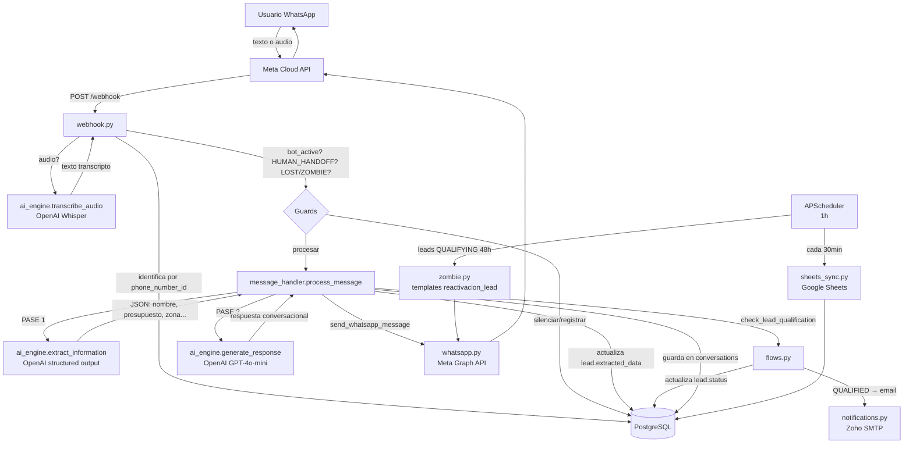

# ARCHITECTURE.md — Ventra AI

Documento de arquitectura actualizado. Estado real del sistema al 2026-03-08.

---

## 1. Flujo end-to-end (mensaje entrante)



### Guards antes de procesar (webhook.py)

| Condición | Acción |
|-----------|--------|
| `bot_active = False` | Solo registra el mensaje, no responde |
| `lead.status = HUMAN_HANDOFF` | Solo registra el mensaje, bot silenciado |
| `lead.status = LOST` + nuevo mensaje | Resurrección: limpia `motivo_rechazo`, status → QUALIFYING |
| `lead.status = ZOMBIE` + nuevo mensaje | Reactivación: status → QUALIFYING |

### Funnel de leads

```
NEW → QUALIFYING → QUALIFIED  (trigger: nombre + presupuesto + zona → email al dueño)
                 → LOST        (trigger: motivo_rechazo en extracted_data)
                 → ZOMBIE      (trigger: APScheduler 48h sin respuesta → template reactivacion_lead)
                 → HUMAN_HANDOFF  (trigger: operador toma control desde dashboard)
```

---

## 2. Mapa de archivos — Backend (`backend/`)

### API (`app/api/`)

| Archivo | Responsabilidad |
|---------|----------------|
| `webhook.py` | GET/POST /webhook — verificación Meta, extracción de audio (Whisper), guards, despacha a process_message |
| `auth.py` | Login email/password, Google OAuth2, JWT tokens, registro |
| `leads.py` | GET /leads/{tenant_id} — lista leads con conversaciones |
| `stats.py` | GET /stats/{tenant_id} — KPIs del dashboard |
| `analytics.py` | GET /analytics/{tenant_id} — datos detallados para gráficos |
| `settings.py` | GET/POST /settings/{tenant_id}, PATCH /settings/{tenant_id}/bot-toggle |
| `templates.py` | CRUD de plantillas WhatsApp vía Meta Graph API + envío |
| `whatsapp_connect.py` | Embedded Signup — recibe token de Facebook y conecta WABA del cliente |
| `chat.py` | GET /ping, POST /test-chat |

### Services (`app/services/`)

| Archivo | Responsabilidad |
|---------|----------------|
| `ai_engine.py` | `extract_information()` (PASE 1, structured output), `generate_response()` (PASE 2), `transcribe_audio()` (Whisper) |
| `message_handler.py` | `process_message()` — orquesta el doble pase IA + guarda en DB |
| `flows.py` | `check_lead_qualification()` — QUALIFIED/LOST según extracted_data, dispara notificación |
| `whatsapp.py` | `send_whatsapp_message()`, `download_audio_bytes()` — Meta Graph API |
| `notifications.py` | `send_email_notification()` — Zoho SMTP, se dispara cuando lead → QUALIFIED |
| `zombie.py` | Protocolo Zombie: busca leads QUALIFYING >48h, envía template `reactivacion_lead` |
| `sheets_sync.py` | Sincroniza leads calificados a Google Sheets del tenant |
| `auth_service.py` | Helpers JWT: crear/verificar token, hash de passwords |

### Models / DB / Schemas

| Archivo | Responsabilidad |
|---------|----------------|
| `app/models/db_models.py` | ORM SQLAlchemy: tablas `users`, `vertical_templates`, `tenants`, `leads`, `conversations` |
| `app/db/base.py` | `declarative_base()` |
| `app/db/database.py` | engine, SessionLocal, `get_db()` |
| `app/schemas/chat.py` | `MessageInput` |
| `app/schemas/settings.py` | `SettingsUpdate` |

### Verticals

| Archivo | Responsabilidad |
|---------|----------------|
| `verticals/real_estate_v1/schema.py` | `ExtractionSchema` Pydantic — campos a extraer (nombre, presupuesto, zona, etc.) |
| `verticals/real_estate_v1/prompts.py` | `REAL_ESTATE_PROMPT`, `SCHEMA_INMOBILIARIA` |

### Scripts (`scripts/`)

| Script | Uso |
|--------|-----|
| `init_db.py` | Crear tablas (primera vez) |
| `seed.py` | Carga inicial: vertical_template + tenant de prueba |
| `reset_db.py` | Drop + recrear tablas (destructivo) |
| `update_prompt.py` | Actualizar system_prompt_base en DB sin tocar código |
| `setup_google_user.py` | Configura usuario Google como admin |
| `fix_admin_whatsapp.py` | Setea phone_number_id y waba_id del tenant 1 |
| `migrate_to_admin.py` | Mueve usuario Google a tenant 1 |
| `seed_demo.py` | Carga leads de demo para presentaciones |

---

## 3. Modelo de datos

| Tabla | Campos clave |
|-------|-------------|
| `users` | `id`, `email`, `password_hash` (nullable), `google_id`, `tenant_id` (FK), `role` |
| `vertical_templates` | `id`, `name`, `assistant_name`, `system_prompt_base`, `required_fields_schema` (JSON) |
| `tenants` | `id`, `name`, `phone_number_id`, `waba_id`, `template_id` (FK), `business_config` (JSON: agent_name, tone, specialty, catalog_url, knowledge_base, rules, bot_active, sheets_id, google_credentials) |
| `leads` | `id`, `whatsapp_id`, `tenant_id` (FK), `status` (NEW/QUALIFYING/QUALIFIED/LOST/ZOMBIE/HUMAN_HANDOFF), `extracted_data` (JSON), `last_message_at`, `created_at` |
| `conversations` | `id`, `lead_id` (FK), `role` (user\|assistant), `content`, `timestamp` |

---

## 4. Mapa de archivos — Frontend (`frontend/src/`)

| Archivo | Qué hace |
|---------|---------|
| `App.jsx` | Rutas: `/` Landing, `/dashboard`, `/settings`, `/templates`, `/analytics`, `/onboarding`, `/auth/google/callback`, `/auth/facebook/callback` |
| `api/client.js` | Base URL desde VITE_API_URL, wrappers de fetch con auth header, parseo de errores Meta |
| `pages/Dashboard.jsx` | Split view: lista de leads + chat + inspector de datos extraídos + bot toggle |
| `pages/Settings.jsx` | Config agente, Embedded Signup WhatsApp, Google Sheets, bot toggle |
| `pages/Templates.jsx` | Lista/crear/borrar/enviar plantillas WhatsApp vía Meta Graph API |
| `pages/Analytics.jsx` | Estadísticas: conversion funnel, leads por día, motivos de pérdida |
| `pages/Onboarding.jsx` | Flujo de 7 pasos para onboarding de nuevo cliente |
| `pages/Landing.jsx` | Landing con precios ($49/$89 USD/mes), propuesta de valor |
| `pages/Login.jsx` | Login email/password + Google OAuth2 popup |
| `pages/GoogleCallback.jsx` | Página callback OAuth Google |
| `pages/FacebookCallback.jsx` | Página callback OAuth Facebook |
| `components/Layout.jsx` | Sidebar: Panel / Estadísticas / Plantillas / Configuración + bot toggle |

---

## 5. Stack tecnológico

### Backend

| Librería | Uso |
|----------|-----|
| FastAPI | Framework API REST |
| SQLAlchemy + psycopg2 | ORM + driver PostgreSQL |
| OpenAI SDK | GPT-4o-mini (extracción + respuesta) + Whisper (audio) |
| APScheduler | Cron jobs: Zombie (1h) + Google Sheets (30min) |
| python-jose + passlib | JWT + hash passwords |
| google-auth | OAuth2 Google |
| gspread | Google Sheets API |
| requests | Meta Graph API calls |
| smtplib | Notificaciones email (Zoho) |

### Frontend

| Librería | Uso |
|----------|-----|
| React + Vite | UI + bundler |
| react-router-dom | Navegación SPA |
| Tailwind CSS | Estilos |
| lucide-react | Iconos |

### Infra

| Elemento | Uso |
|----------|-----|
| PostgreSQL | DB persistente |
| Railway | Deploy backend + DB |
| Vercel | Deploy frontend |
| Meta Cloud API | WhatsApp (webhook + envío) |
| OpenAI API | IA (GPT-4o-mini + Whisper) |
| Google Sheets API | Sync de leads calificados |
| Zoho Mail SMTP | Notificaciones email |

---

## 6. Variables de entorno (`backend/.env`)

```
DATABASE_URL=             # PostgreSQL connection string
OPENAI_API_KEY=           # OpenAI (GPT + Whisper)
WHATSAPP_TOKEN=           # Meta WhatsApp Cloud API token (expira, renovar en Meta for Devs)
WHATSAPP_PHONE_ID=        # Meta phone number ID (fallback si no hay tenant)
WEBHOOK_VERIFY_TOKEN=     # Token verificación webhook Meta (default: "admin")
NOTIFY_EMAIL=             # Email destino para notificaciones QUALIFIED
SMTP_HOST=                # smtp.zoho.com
SMTP_PORT=                # 587
SMTP_USER=                # Cuenta Zoho
SMTP_PASS=                # Contraseña Zoho
GOOGLE_CLIENT_ID=         # OAuth2 Google
GOOGLE_CLIENT_SECRET=     # OAuth2 Google
SECRET_KEY=               # JWT signing key
FRONTEND_URL=             # https://somosvertical.ar
```

`frontend/.env`:
```
VITE_API_URL=https://api.somosvertical.ar   # producción
# VITE_API_URL=http://localhost:8000        # desarrollo
```
