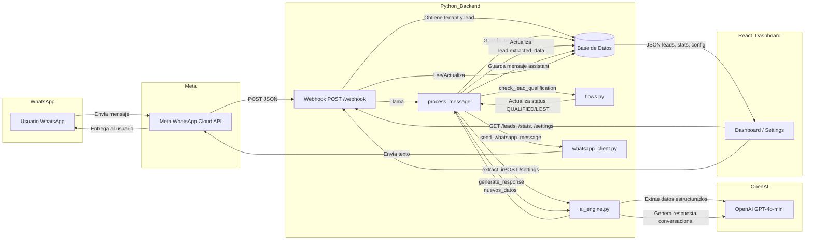

# ARCHITECTURE.md — Ventra AI

Documento de arquitectura para dueños, inversores y nuevos desarrolladores. Explica cómo funciona el sistema de punta a punta.

---

## 1. Diagrama de Flujo (Mermaid.js)

Cómo viaja un mensaje desde WhatsApp hasta la base de datos, la IA y de vuelta al usuario (y cómo el dashboard React consume esos datos).

### Flujo paso a paso (mensaje entrante)

1. **Meta WhatsApp Cloud API** recibe el mensaje del usuario y hace un POST a tu servidor en `/webhook`.
2. **main.py** recibe el webhook, parsea el número y el texto (JSON de Meta), busca o crea el **Tenant** y el **Lead** en la base de datos.
3. **process_message** guarda el mensaje del usuario en la tabla **Conversation**, luego llama a **ai_engine**:
   - **PASE 1 — Extracción:** `extract_information()` envía el mensaje a **OpenAI** con un esquema (nombre, presupuesto, zona, tipo_propiedad, motivo_rechazo, etc.) y devuelve datos estructurados que se guardan en `lead.extracted_data`.
   - **flows.check_lead_qualification** actualiza el estado del lead (QUALIFIED, LOST, etc.) según esos datos.
   - **PASE 2 — Respuesta:** `generate_response()` arma un prompt con la configuración del negocio y los datos del lead, llama de nuevo a **OpenAI** y obtiene el texto de respuesta.
4. Esa respuesta se guarda en **Conversation** y se envía al usuario vía **whatsapp_client** (Meta).
5. El **Dashboard React** consume los mismos datos vía `GET /leads/{tenant_id}`, `GET /stats/{tenant_id}` y `GET/POST /settings/{tenant_id}`, leyendo y mostrando lo que ya está en la base de datos.

---

## 2. Diccionario de Datos (models.py)

Descripción de cada tabla y qué datos guarda.

| Tabla | Propósito | Datos que guarda |
|-------|-----------|-------------------|
| **vertical_templates** | Plantillas por industria (ej. inmobiliaria). Define el “cerebro” base del asistente y los campos a extraer. | `id`, `name` (ej. real_estate_v1), `assistant_name` (ej. Ana), `system_prompt_base` (prompt plantilla), `required_fields_schema` (JSON con campos como nombre, presupuesto, zona). |
| **tenants** | Clientes del sistema (cada negocio que usa Ventra). Un tenant = un negocio con su WhatsApp y su configuración. | `id`, `name`, `phone_number_id`, `template_id` (FK a vertical_templates), `business_config` (JSON: agent_name, tone, specialty, catalog_url, knowledge_base, rules). |
| **leads** | Usuarios finales que escriben por WhatsApp. Un lead = una conversación con un posible cliente de un tenant. | `id`, `whatsapp_id`, `tenant_id` (FK a tenants), `status` (NEW, QUALIFYING, QUALIFIED, HUMAN_HANDOFF, LOST), `extracted_data` (JSON: nombre, presupuesto, zona, tipo_propiedad, motivo_rechazo, etc.), `created_at`. |
| **conversations** | Historial de mensajes de cada lead. Cada fila es un mensaje (usuario o asistente). | `id`, `lead_id` (FK a leads), `role` (user | assistant), `content` (texto del mensaje), `timestamp`. |

### Relaciones

- Un **Tenant** tiene una **VerticalTemplate** y muchos **Leads**.
- Un **Lead** tiene muchas **Conversations**.
- Toda la lógica de negocio (calificación, notificaciones) usa `lead.extracted_data` y `lead.status`.

---

## 3. Mapa de Archivos

Qué hace cada archivo en una oración.

### Backend (raíz del proyecto)

| Archivo | Qué hace |
|---------|----------|
| **main.py** | Aplicación FastAPI: expone webhook de WhatsApp, endpoints de prueba, endpoints para el dashboard (leads, stats, settings) y orquesta el flujo de mensajes llamando a process_message, base de datos y whatsapp_client. |
| **ai_engine.py** | Motor de IA: usa OpenAI para extraer datos estructurados del mensaje del usuario (PASE 1) y para generar la respuesta del asistente (PASE 2) según la configuración del tenant. |
| **database.py** | Configuración de base de datos: crea el engine de SQLAlchemy, la sesión (SessionLocal) y la función get_db para inyectar la sesión en los endpoints. |
| **models.py** | Modelos ORM: define las tablas vertical_templates, tenants, leads y conversations y sus relaciones para SQLAlchemy. |
| **flows.py** | Lógica de calificación y notificaciones: determina si un lead pasa a QUALIFIED o LOST según extracted_data y dispara (hoy por consola) la notificación al negocio cuando hay lead calificado. |
| **whatsapp_client.py** | Cliente de envío a WhatsApp: envía el mensaje de respuesta usando Meta WhatsApp Cloud API. |
| **dashboard.py** | Dashboard alternativo en Streamlit: muestra KPIs, lista de leads y auditoría de chat leyendo de la misma base de datos (tenant_id = 1). |
| **init_db.py** | Script de inicialización: crea todas las tablas en la base de datos usando los modelos definidos en models.py. |
| **reset_db.py** | Script de reset: borra todas las tablas y las vuelve a crear (útil para desarrollo). |
| **seed.py** | Carga inicial: crea la plantilla “Inmobiliaria V1” y el tenant de prueba “Inmobiliaria Branc” si no existen. |
| **update_prompt.py** | Utilidad: actualiza el system_prompt_base de la plantilla real_estate_v1 en la base de datos sin tocar código. |

### Frontend (ventra-web)

| Archivo | Qué hace |
|---------|----------|
| **src/App.jsx** | Punto de entrada de rutas: define las rutas / (Landing), /dashboard y /settings, y envuelve dashboard y settings con el Layout. |
| **src/main.jsx** | Monta la aplicación React en el DOM y aplica StrictMode. |
| **src/pages/Landing.jsx** | Página de marketing: landing con propuesta de valor, demo y botón para ir al dashboard. |
| **src/pages/Dashboard.jsx** | Bandeja de entrada: consume GET /leads y GET /stats, muestra lista de leads, chat por lead y datos extraídos (presupuesto, zona, tipo de propiedad). |
| **src/pages/Settings.jsx** | Configuración del agente: carga y guarda GET/POST /settings para nombre del negocio, asistente, tono, especialidad, catálogo y base de conocimiento. |
| **src/components/Layout.jsx** | Layout con sidebar: menú (Dashboard, Configuración), logo Ventra AI y estado “Bot Activo”, envuelve el contenido de dashboard y settings. |

---

## 4. Stack Tecnológico

Librerías y herramientas clave y para qué se usan.

### Backend (Python)

| Librería | Uso en el proyecto |
|----------|--------------------|
| **FastAPI** | API REST: webhook, endpoints de prueba y endpoints para el dashboard (leads, stats, settings); validación con Pydantic y inyección de sesión de base de datos. |
| **uvicorn** | Servidor ASGI para ejecutar la aplicación FastAPI en producción o desarrollo. |
| **SQLAlchemy** | ORM y conexión a base de datos: definición de modelos, sesiones y consultas a PostgreSQL. |
| **psycopg2** | Driver de PostgreSQL para que SQLAlchemy se conecte a la base de datos. |
| **python-dotenv** | Carga variables de entorno desde `.env` (API keys, DATABASE_URL, credenciales Meta). |
| **openai** | Cliente oficial de OpenAI: llamadas a GPT-4o-mini para extracción estructurada (beta parse) y para generación de respuestas del asistente. |
| **requests** | Peticiones HTTP para enviar mensajes a la API de Meta (WhatsApp). |

### Frontend (ventra-web)

| Librería | Uso en el proyecto |
|----------|--------------------|
| **React** | Construcción de la interfaz: páginas (Landing, Dashboard, Settings) y componentes reutilizables (Layout). |
| **Vite** | Bundler y servidor de desarrollo: compilación rápida y hot reload del frontend. |
| **react-router-dom** | Navegación entre Landing, Dashboard y Settings sin recargar la página. |
| **Tailwind CSS** | Estilos: diseño del dashboard, formularios y landing sin CSS a mano. |
| **lucide-react** | Iconos (MessageSquare, CheckCircle2, Bot, Settings, etc.) en toda la app. |

### Infra y servicios externos

| Elemento | Uso en el proyecto |
|----------|--------------------|
| **PostgreSQL** | Base de datos persistente para tenants, leads, conversaciones y plantillas (URL en `DATABASE_URL`). |
| **Meta WhatsApp Cloud API** | Envío y recepción de mensajes de WhatsApp vía webhook (WHATSAPP_TOKEN, WHATSAPP_PHONE_ID). |
| **OpenAI API** | Extracción de datos del mensaje y generación de respuestas del asistente (GPT-4o-mini). |

---

## Resumen para explicar a inversores o nuevos programadores

- **Usuario escribe por WhatsApp** → Meta envía el mensaje al backend en `/webhook`.
- **Backend (Python/FastAPI)** identifica negocio (tenant) y conversación (lead), guarda el mensaje, pide a **OpenAI** que extraiga datos y que genere la respuesta, actualiza estado del lead (calificado/perdido) y guarda todo en **PostgreSQL**.
- **Respuesta** se envía de vuelta por **whatsapp_client** (Meta) al usuario.
- **Dashboard React** consume la misma API (leads, stats, settings) para mostrar conversaciones, KPIs y configurar el agente sin tocar código.

Con este documento puedes recorrer el flujo completo, entender cada tabla, cada archivo y cada tecnología del proyecto.
